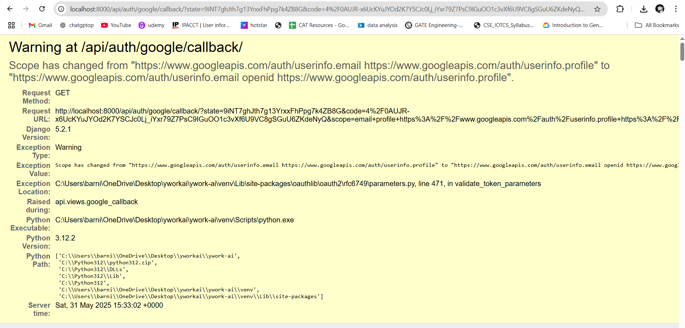
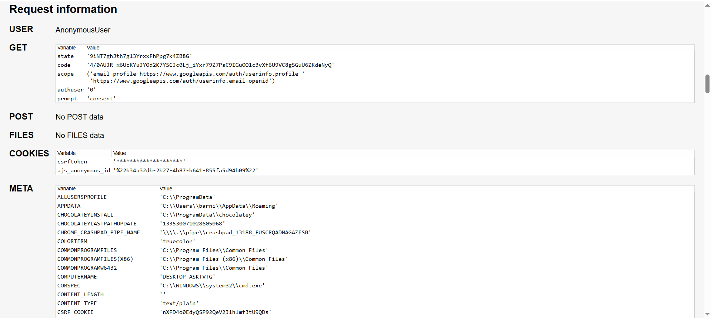

          
# YWork AI - Order Management System


A robust Django REST Framework-based order management system with Google OAuth 2.0 authentication, providing secure and efficient data entry and retrieval APIs.

## MEDIA 




LOOP VIDEO LINK : https://www.loom.com/share/41561e4a7f584dfca4b73204314ff0cd?sid=69213a2e-2dad-45b8-a8d4-11be585245d0

## Features


- **Secure Authentication**: Implements Google OAuth 2.0 for user authentication
- **RESTful APIs**: Comprehensive endpoints for order management
- **User Profiles**: Automatic profile creation and management
- **Order Management**: Create, read, update, and delete order functionality
- **Search Capability**: Filter orders by title

## System Architecture


## Prerequisites

- Python 3.12+
- Django 5.0+
- Django REST Framework
- Google OAuth2 credentials

## Installation

1. **Clone the repository**

2. **Set up a virtual environment**
   ```bash
   python -m venv venv
   .\venv\Scripts\activate
   ```

3. **Install dependencies**
   ```bash
   pip install django djangorestframework google-auth-oauthlib google-auth google-api-python-client
   ```

4. **Configure Google OAuth**
   - Create a project in Google Cloud Console
   - Enable the OAuth 2.0 API
   - Create OAuth 2.0 credentials
   - Set the authorized redirect URI to: `http://localhost:8000/api/auth/google/callback`
   - Update `settings.py` with your credentials:
     ```python
     GOOGLE_CLIENT_ID = 'your-client-id'
     GOOGLE_CLIENT_SECRET = 'your-client-secret'
     GOOGLE_REDIRECT_URI = 'http://localhost:8000/api/auth/google/callback'
     ```

5. **Apply migrations**
   ```bash
   python manage.py migrate
   ```

6. **Run the development server**
   ```bash
   python manage.py runserver
   ```

## API Endpoints

### Authentication

- `GET /api/auth/google/`: Initiates Google OAuth flow
- `GET /api/auth/google/callback/`: OAuth callback endpoint

### Orders

- `GET /api/orders/`: List all orders for authenticated user
- `POST /api/orders/`: Create a new order
- `GET /api/orders/{id}/`: Retrieve specific order
- `PUT /api/orders/{id}/`: Update specific order
- `DELETE /api/orders/{id}/`: Delete specific order

## Authentication Flow

1. Client requests authentication via `/api/auth/google/`
2. User is redirected to Google login
3. After successful authentication, Google redirects to callback URL
4. System creates/updates user profile and returns access token
5. Use access token in Authorization header for subsequent requests


## Security Considerations

- OAuth credentials are stored securely in settings
- Token-based authentication for API requests
- Automatic token refresh handling
- User-specific data isolation


        
